# ClassyCouture – Complete Project Summary _(updated November 9 2025)_

ClassyCouture is a ready-to-launch e-commerce platform that pairs a modern **Next.js 16 + React 19** storefront (HeroUI + custom iOS design system) with a **Django 4.2 REST API**. Out of the box you already have authentication, product browsing, inventory control, orders, refunds, vouchers, referrals, watchlists, reviews, complaints, analytics, and a fully documented collections builder.

---

## In Plain Terms
- **Shoppers** can register, log in, browse curated collections, place orders, track deliveries, save favorites, leave reviews, and manage complaints/referrals directly from the responsive web app.
- **Store teams** get a central admin dashboard with live analytics, inventory editing, voucher management, banner control, refund handling, and the brand-new hierarchical collections manager.
- **Technology** is fully upgraded (Next.js 16, React 19.2, Django 4.2.26) and the UI layer has been migrated to **HeroUI**, so future pages share the same polished iOS-inspired look.
- **Documentation + tooling** cover quick start, setup, API references, feature guides, troubleshooting, and competitive analysis so non-technical folks can onboard quickly.

---

## Health Dashboard

| Area | Status | What it means | Key files / routes |
|------|--------|---------------|--------------------|
| Customer experience | ✅ Live | Login, register, dashboard, watchlist, reviews, complaints, referrals already work end-to-end. | `frontend/app/auth/*`, `frontend/app/dashboard/*` |
| Admin operations | ✅ Core · 🚧 Extras | Dashboard analytics, inventory editor, banner/voucher tools, and the **collections builder** ship today; remaining admin sub-pages (orders, refunds, vouchers 2.0) are scoped for Phase 2. | `frontend/app/admin-dashboard/page.tsx`, `frontend/components/admin/*` |
| Backend services | ✅ Complete | 14 models + 30+ endpoints handle users, products, orders, tracking, refunds, vouchers, analytics, referrals, complaints, watchlists. | `backend/api/*.py` |
| Design system & UI kit | ✅ Complete | HeroUI migration finished; glassmorphism + iOS tokens preserved and reusable. | `frontend/tailwind.config.ts`, `frontend/components/ui/*`, `HEROUI_MIGRATION.md` |
| Collections system | ✅ Complete | Unlimited nested collections visible in admin with live product counts and CRUD UI. | `COLLECTIONS_INTEGRATION_COMPLETE.md`, `frontend/components/admin/CollectionsManager.tsx` |
| Infrastructure add-ons | 🚧 In progress | Payment processors, email/SMS alerts, and advanced analytics hooks are outlined and partially pre-wired but need credentials + UI. | `PHASE_2_IMPLEMENTATION.md`, `IMPLEMENTATION_GUIDE.md` |
| Automated testing | ⏳ Planned | Manual QA only today; unit/integration/E2E suites are queued. | `COMPLETE_DOCUMENTATION.md#testing--qa` |

**Legend**: ✅ Done 🚧 Partially done / limited ⏳ Planned

---

## What People Can Do Today

### Shoppers
- Register or log in, then browse curated collections and featured categories.
- Add products to watchlists, leave verified purchase reviews, and file complaints.
- Place orders, apply vouchers, request refunds, and follow tracking updates.
- Earn/share referral codes and monitor loyalty points on the dashboard.

### Store Team
- View real-time sales tiles, order stats, and referral performance on `/admin/dashboard`.
- Edit product stock, SKU, pricing, and discount flags inline.
- Create and organize collections with unlimited nesting, hero images, and display order.
- Launch home-page banners, issue vouchers, and review refund queues.
- Use Django Admin for deep data edits, custom filters, and bulk actions.

---

## Visual Overview

```mermaid
graph LR
    Shopper["Customer (mobile/desktop)"] --> Frontend["Next.js 16 Frontend\nHeroUI + iOS design system"]
    Admin["Store admin (browser)"] --> Frontend
    Frontend --> API["Django REST API\nAuth • Orders • Collections • Analytics"]
    API --> DB["SQLite (dev) / PostgreSQL (prod)"]
    API --> Services["Background tasks & analytics"]
    Services --> Future["Email · SMS · Payments (Phase 2)"]
```

---

## Customer Order Journey

---

## Recent Highlights (Nov 2025)
- **Hierarchical Collections Builder** – Tree view with search, badges, and modal forms, fully integrated into the admin dashboard (`COLLECTIONS_INTEGRATION_COMPLETE.md`).
- **HeroUI Migration** – Entire UI kit now uses HeroUI components while preserving the custom iOS visual language (`HEROUI_MIGRATION.md`).
- **Massive Dependency Refresh** – Next.js 16, React 19.2, TypeScript 5.9, Django 4.2.26, DRF 3.16, plus WebSocket-ready Channels support (`VERSION_UPDATES.md`).
- **Documentation Suite** – Complete onboarding, troubleshooting, implementation, and feature guides consolidated for technical and non-technical readers (`COMPLETE_DOCUMENTATION.md`).

---

## Ready-to-Run Checklist (5 minutes)
1. **Backend** – `cd backend && python3 -m venv venv && source venv/bin/activate && pip install -r requirements.txt && python manage.py migrate && python manage.py runserver 0.0.0.0:8000`
2. **Frontend** – `cd frontend && npm install && echo "NEXT_PUBLIC_API_URL=http://localhost:8000" > .env.local && npm run dev`
3. Visit **http://localhost:3000** (storefront), **http://localhost:8000/api/** (API), **http://localhost:8000/admin/** (Django admin).
4. Create a Django superuser (`python manage.py createsuperuser`) and test the admin dashboard at `/admin/dashboard`.

---

## Capability Inventory

### Backend (Django + DRF)
- Authentication (register/login), profile management, referral code generation.
- Product catalog with SKU, inventory, discounting, featured toggles, and derived pricing.
- Orders, order items, cancelation flows, shipment tracking, and refund processing.
- Voucher CRUD + validation, banner management, daily sales analytics.
- Watchlists, product reviews, complaints, referral insights with role-based permissions.
- Collections API with recursive parent/child handling and product counts.

### Frontend (Next.js 16 + HeroUI)
- Auth screens, admin dashboard, inventory editor, collections tab, voucher and banner controls, user dashboard modules for orders, watchlist, reviews, refunds, referrals.
- Shared UI library (buttons, inputs, cards, modals) with glassmorphic iOS theme plus HeroUI components (tabs, popovers, tables, breadcrumbs, etc.).
- Responsive layout, safe-area handling, animations, and Turbopack dev experience upgrades.

### Documentation & Ops
- QUICKSTART, SETUP, IMPLEMENTATION, FEATURES, COMPLETE_DOCUMENTATION, ACCOUNT/ COLLECTIONS guides, troubleshooting tips, and competitive analysis comparisons.
- Connection status, deployment plans, Heroku/Vercel guidance, PostgreSQL setup, payment email guide, and detailed phase-2 implementation notes.

---

## Known Gaps & Next Focus
1. **Payments & notifications** – Wire Stripe/PayPal plus email/SMS triggers (webhooks, transactional templates).
2. **Remaining admin & user detail pages** – Dashboard profile editor, order detail view, dedicated watchlist/review/referral pages, and admin order/refund managers.
3. **Automated testing** – Unit (backend/frontend), integration (API + UI), and E2E (Cypress/Playwright) suites.
4. **Performance & security hardening** – Caching (Redis already introduced), rate limiting, security headers, accessibility review.
5. **Production deployment** – Move to PostgreSQL, configure environment secrets, collect static files, add CDN + HTTPS, and set up monitoring.

---

## Documents to Keep Handy

| Need | Where to look |
|------|---------------|
| Run everything quickly | `README_START_HERE.md`, `QUICKSTART.md` |
| Full setup + troubleshooting | `SETUP_GUIDE.md`, `TROUBLESHOOTING.md` |
| API + feature deep dive | `FEATURES_GUIDE.md`, `FEATURES_SUMMARY.md`, `IMPLEMENTATION_GUIDE.md` |
| Collections playbook | `HOW_TO_CREATE_COLLECTIONS.md`, `COLLECTIONS_INTEGRATION_COMPLETE.md` |
| Design & UI updates | `HEROUI_MIGRATION.md`, `IOS_DESIGN_SYSTEM.md`, `NAVBAR_*` guides |
| Release + fixes log | `VERSION_UPDATES.md`, `FIXES_APPLIED.md`, `PHASE_2_IMPLEMENTATION.md` |

---

**Takeaway**: The core shopping and admin experience is production-ready, visually polished, and fully documented. Focus next on payments, notifications, detail pages, and automated testing to finish the launch checklist. Once those are in place, ClassyCouture can confidently move from staging to a live storefront.
